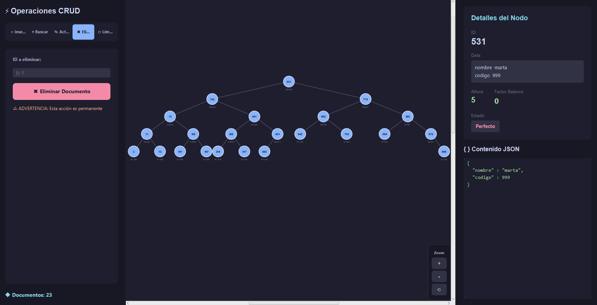

<div align="center">


<h1>Gestor de Bases de Datos No Relacional</h1>

<h4>Sistema de almacenamiento de documentos JSON con indexacion mediante arboles AVL autobalanceados</h4>

<br/>


</div>

## Acerca del Proyecto

> **NoSQL Database Manager** es un gestor de bases de datos no relacional desarrollado en Java, que utiliza **arboles AVL autobalanceados** como estructura de indexacion primaria.

El sistema almacena documentos en formato JSON y proporciona una interfaz grafica moderna construida con JavaFX.

## Estructura del Proyecto

<br/>

```
src/main/java/com/nosqlmanager/
│
├── App.java                     # Punto de entrada
│
├── tree/                        # Arbol AVL
│   ├── AVLTree.java            # Implementacion generica
│   └── AVLNode.java            # Nodo con altura y balance
│
├── model/                       # Modelos
│   └── JsonDocument.java       # Documento JSON
│
├── manager/                     # Logica de negocio
│   └── DatabaseManager.java    # Gestor principal
│
├── repository/                  # Acceso a datos
│   └── DocumentRepository.java # Interfaz
│
├── storage/                     # Persistencia
│   └── JsonFileStorage.java    # Almacenamiento
│
└── gui/                         # Interfaz grafica
    ├── MainView.java           # Vista principal
    └── TreeVisualizer.java     # Visualizador
```

---

## Instalacion

### Requisitos Previos

<div align="center">

| | Requisito | Version | Descarga |
|:---:|:----------|:-------:|:--------:|
|  | Java JDK | `21+` | [oracle.com](https://www.oracle.com/java/technologies/downloads/) |
|  | Apache Maven | `3.8+` | [maven.apache.org](https://maven.apache.org/download.cgi) |
|  | Git | `2.0+` | [git-scm.com](https://git-scm.com/downloads) |

</div>

<br/>

### Pasos de Instalacion

**1. Clonar el repositorio**

```bash
git clone https://github.com/JkVely/BDnoSQL.git
cd BDnoSQL
```

**2. Verificar requisitos**

```bash
java --version    # Debe mostrar version 21 o superior
mvn --version     # Debe mostrar version 3.8 o superior
```

**3. Compilar el proyecto**

```bash
mvn clean compile
```

**4. Ejecutar las pruebas**

```bash
mvn test
```

---

## Uso

### Ejecutar la Aplicacion

```bash
mvn javafx:run
```

### Interfaz Grafica



### Controles de Navegacion

<div align="center">

| Accion | Control | Descripcion |
|:------:|:-------:|:------------|
| Zoom | `Ctrl` + `Scroll` | Acercar o alejar la vista del arbol |
| Mover | `Click Derecho` + `Arrastrar` | Desplazar el canvas |
| Seleccionar | `Click Izquierdo` | Ver detalles del nodo |
| Reset | Boton `⟲` | Restablecer zoom y posicion |

</div>

---

## Estructura JSON

<center>
<table>
<tr>
<td width="50%">

### Documento Individual

```json
{
    "nombre": "Juan",
    "edad": 25,
    "activo": true
}
```

</td>
<td width="50%">

### Base de Datos

```json
[ {
  "id" : 2,
  "data" : {
    "nombre" : "gio",
    "codigo" : 180
  }
},
...
]
```

</td>
</tr>
</table>
</center>

---

## Pruebas

```bash
mvn test                              # Ejecutar pruebas
mvn test -Dsurefire.useFile=false     # Con reporte detallado
```

<div align="center">

| Componente | Tests | Estado |
|:-----------|:-----:|:------:|
| AVLTree - Insercion | 5 |  |
| AVLTree - Eliminacion | 4 |  |
| AVLTree - Balanceo | 3 |  |
| DatabaseManager - CRUD | 4 |  |
| DatabaseManager - Busqueda | 3 |  |

</div>

---

## Stack Tecnologico

<div align="center">


</div>

---

## Autores

<div align="center">

| | Nombre | codigo |
|:---:|:---:|:---:|
|  | **Nicole Daza** | |
| [](https://www.github.com/JkVely) | **Juan Carlos Quintero** | `20232020172` |
|  | **Juan David Avila** | |
|  | **Brayan Castro** | |

</div>

---
